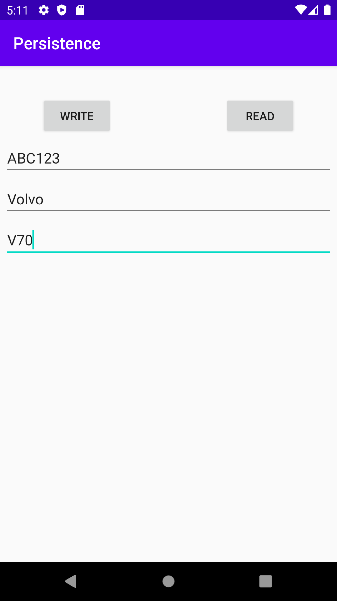

# Rapport

- [x] In your layout file add at least the following widgets: a `TextView`, two `Button` views, and at least three `EditText` views.
Minimum required Views/Widgets added to activity_main.xml.

- [x] Name the buttons 'Read' and 'Write'
Both buttons name changed to Read and Write.

- [x] When the user taps (clicks) the 'Write' button the values in the EditText views should be written as a single row to a SQLite database table
The following code is executed when the button named 'Write' is pressed;
```java
private void insertSQLData() {
    ContentValues values = new ContentValues();
    values.put(DatabaseTables.Car.COLUMN_LICNO, inputLicNo.getText().toString());
    values.put(DatabaseTables.Car.COLUMN_BRAND, inputBrand.getText().toString());
    values.put(DatabaseTables.Car.COLUMN_MODEL, inputModel.getText().toString());
    databaseHelper.getWritableDatabase().insert(DatabaseTables.Car.TABLE_NAME, null, values);
}
```
This method works by taking the current text in each of the editText views and pairing them with the respective column from the SQLite table.
All key values are then inserted into the table. The class `DatabaseTables.Car` holds constants for the table name and columns.



- [x] When the user taps the 'Read' button, all rows should be read from the database and displayed in the TextView.
The following code is executed when the button named 'Read' is pressed;
```java
private void readSQLData() {
        Cursor cursor = databaseHelper.getReadableDatabase().rawQuery(
                "SELECT * FROM " + DatabaseTables.Car.TABLE_NAME,
                null,
                null);
        String displayText = "";
        while(cursor.moveToNext()) {
            displayText = displayText + String.format("%s : %s %s\n",
                    cursor.getString(cursor.getColumnIndexOrThrow(DatabaseTables.Car.COLUMN_LICNO)),
                    cursor.getString(cursor.getColumnIndexOrThrow(DatabaseTables.Car.COLUMN_BRAND)),
                    cursor.getString(cursor.getColumnIndexOrThrow(DatabaseTables.Car.COLUMN_MODEL)));
        }
        displayView.setText(displayText);
    }
```
This method works by creating a query against the database to retrieve all entries.
It then loops through all entries and stitch together a String by appending the newest iteration table data to the end,
using the format `String.format("%s : %s %s\n",...)` where %s represents the String value from the database in order, and \n breaks the line.
Lastly the displayView gets its content set to the stitched String.


- [x] The items written to the database and shown in the TextView cannot be Mountains
The values stored in this database are related to Cars, a License number, a brand and a model. See screenshots
